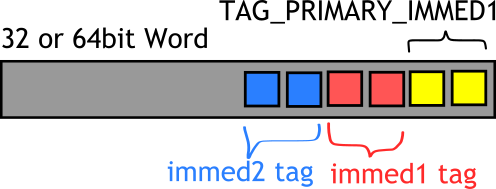
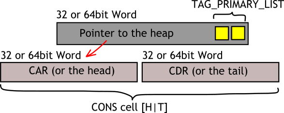

Data Types Memory Layout
========================

This describes data format on heap, as seen in C code or from debugger.
You will never be able to see this format from Erlang code.

Immediate values
----------------



Immediate types always occupy 1 :ref:`Word <def-word>`. To know if you found
an immediate, its least-significant 2 bits will have value ``TAG_PRIMARY_IMMED1``.

To know what exactly immediate you've got where 2 following bits may be
0 (``_TAG_IMMED1_PID``), 1 (``_TAG_IMMED1_PORT``), 3 (``_TAG_IMMED1_SMALL``)
which leaves remaining :ref:`Word-size <def-word>` minus 4 bits for actual value.

If the bits 2,3 were equal 3 (``_TAG_IMMED1_IMMED2``) then 2 more bits are taken
and interpreted too. They can be 0 (``_TAG_IMMED2_ATOM``), 1 (``_TAG_IMMED2_CATCH``)
or 3 (``_TAG_IMMED2_NIL``),
which leaves remaining :ref:`Word-size <def-word>` minus 6 bits for actual value.
This also explains why max physical limit of atoms on 32-bit systems is
``32-6=2^26`` (32 million). For compatibility reasons this limit also applies to
64-bit systems.

Lists (Cons)
------------



A list term is boxed value (i.e. contains a pointer to heap). 2 least-significant
bits of list value have ``TAG_PRIMARY_LIST=1``, remaining bits are the pointer.

A value on heap
contains 2 :ref:`Words <def-word>` -- namely CAR (or list head) and
CDR (list tail) (see ``CAR`` and ``CDR`` macros in ``erl_term.h``).
This pair of words is called "Cons Cell" (terminology from
Lisp and functional programming). Cons cell has no header word stored in memory.

Each cons cell contains pointer to next cell in CDR (tail).
As this is also visible from Erlang, last cons cell of a list contains ``NIL``
(empty list []) for tail, or a non-list :ref:`Term <def-term>` value.

Boxed
-----

Boxed value is a pointer with 2 least-significant bits tagged with
``TAG_PRIMARY_BOXED=2``. Remaining bits are the pointer.

A boxed pointer must always point to a :ref:`Header <def-header>`
(see explanation of headers below). Boxed values can be found everywhere:
in registers, on stack, on heaps.

Headers
-------

Header tag is placed on any boxed value on heap, also on temporary blocks used
by internal emulator logic, they will be automatically garbage collected later.

Header values can never be found in register or on stack. This is heap-only data structure.

Tuple (ARITYVAL=0)
`````````````````````````

A tuple has header word tagged with ``TAG_PRIMARY_HEADER`` with ``ARITYVAL_SUBTAG``.
Remaining bits in header word represent tuple arity
(see ``arityval`` and ``make_arityval`` macros).

Following are tuple elements. This explains, why tuple is very easy to access at
arbitrary index, and very hard to grow. Modification of tuple elements in place
is used as optimization by Erlang compiler if it can prove, that intermediate
tuple value will be dropped.

Bignum (NEG=2/POS_BIG=3)
```````````````````````````````

Bignums have header word tagged with ``TAG_PRIMARY_HEADER`` followed by either
``POS_BIG_SUBTAG`` or ``NEG_BIG_SUBTAG``. Remaining bits in header word are arity,
i.e. how many extra :ref:`Words <def-word>` are used by bignum bits.

Following are bits of the bignum, a :ref:`Word <def-word>` at a time.
Most significant word goes first.

Reference (REF=4)
````````````````````````

See struct ``RefThing`` in ``erl_term.h``.
Contains header word tagged with ``TAG_PRIMARY_HEADER`` with ``REF_SUBTAG`` which
also matches the first field of ``RefThing``.

Following are other ``RefThing`` fields (3 32-bit words or 2 64-bit words) which
have the ref value stored in them. Internal (local) ref layout is explained in
``erl_term.h`` search for text "Ref layout (internal references)" and
"Ref layout on a 64-bit" (2 comments).

Fun/Closure (FUN=5)
``````````````````````````

See struct ``ErlFunThing`` in ``erl_fun.h``.
Contains header word tagged with ``TAG_PRIMARY_HEADER`` with ``FUN_SUBTAG`` which
also matches the first field of ``ErlFunThing``.

This is a closure (a function pointer with frozen variable values). It contains
pointer to function entry, arity, amount
of frozen variables, pid of creator process and array of frozen variables.

Float (FLOAT=6)
``````````````````````

Contains header word tagged with ``TAG_PRIMARY_HEADER`` with ``FLOAT_SUBTAG``.
Followed by 64 bit of C ``double`` IEEE-754 format.

Export (EXPORT=7)
````````````````````````

Reference-counted Binary (REFC_BINARY=8)
```````````````````````````````````````````````

Heap Binary (HEAP_BINARY=9)
``````````````````````````````````

Sub-binary (SUB_BINARY=10)
``````````````````````````````````

Ext Pid 12
```````````````

Ext Port 13
`````````````````

Ext Ref (EXTERNAL_REF=14)
``````````````````````````````````````

External ref format is explained in ``erl_term.h`` search for "External thing layout".
